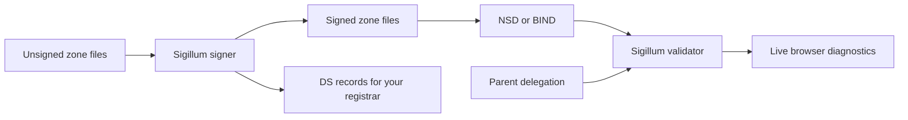

# Sigillum

[](https://github.com/ptudor/sigillum-dnssec/actions/workflows/ci.yml)
[](.go-version)
[](LICENSE)

**DNSSEC tools for people who operate their own nameservers.** Sigillum pairs an
automatic zone signer with a browser-based validator: keep your zones signed, then
inspect how their chain of trust looks from the outside.

The signer fits beside NSD or BIND and works with ordinary zone files. The validator
streams its findings as it walks DNS delegations and checks signatures. Both are
Go programs with embedded web interfaces and no database to administer.

[Install](#install) · [Try the signer](#try-the-signer) · [Try the validator](#try-the-validator) · [Operations](docs/linux-packages.md) · [Releases](docs/releases.md)

## Two tools, one operational loop

| Tool | What it does | Executable |
| --- | --- | --- |
| **Signer** | Watches zones, signs changes, refreshes signatures, manages key rollovers, and exposes status and DS records. | `dnssec-tudor` |
| **Validator** | Inspects DNSSEC chains, authoritative-server agreement, authenticated denial, and optional registrar DS information. | `dnssec-validator` |



The programs run independently. Use the signer without the validator, or point the
validator at zones signed by any other DNSSEC implementation. The existing binary
names are retained so deployment commands and integrations remain familiar.

## What makes it useful

- **An explicit signing lifecycle.** ED25519 is the default; ECDSA P-256 and P-384
  are also supported. Choose NSEC or NSEC3. ZSK rotation is automatic; KSK and
  algorithm rollovers expose the operator steps and parent-DS checks.
- **Publication-aware rollover.** Configure whether a successful reload hook,
  an authoritative SOA probe, or writing the signed file confirms publication.
  Rollover timing follows that choice.
- **Observable validation.** See progress through Server-Sent Events, retrieve a
  JSON result, and inspect per-server discrepancies instead of reducing every
  failure to a red light.
- **Careful trust boundaries.** Loaded root anchors must match pinned root DS
  values. Public validation blocks private DNS destinations by default, bounds
  work, and rate-limits requests.
- **Small deployment surface.** Static release binaries, embedded dashboards,
  TOML configuration, structured logs, health endpoints, and Prometheus metrics.
  Registrar automation and external heartbeats are opt-in.

## Install

Download development binaries and packages from the artifacts of a successful
[CI run](https://github.com/ptudor/sigillum-dnssec/actions/workflows/ci.yml).
Choose the `sigillum-dnssec-snapshot` artifact and the file matching your platform.
See [build and verification instructions](docs/releases.md) for source builds,
checksums, and the distinction between development artifacts and tagged releases.

| Platform | Architectures | Distribution |
| --- | --- | --- |
| Linux | amd64, arm64 | `.tar.gz`, `.rpm`, `.deb` |
| FreeBSD | amd64, arm64 | `.tar.gz`; rc.d examples included |
| macOS | amd64, arm64 | `.tar.gz` for local tools and development |

Archives contain **both** executables. Linux packages are separate: install only
the signer or validator you need. In a directory containing the downloaded files:

```sh
# Debian / Ubuntu
sudo apt install ./dnssec-tudor_*_amd64.deb ./dnssec-validator_*_amd64.deb

# Fedora / RHEL family (local packages are unsigned)
sudo dnf --setopt=localpkg_gpgcheck=0 install ./dnssec-tudor-*.x86_64.rpm ./dnssec-validator-*.x86_64.rpm
```

Use the `arm64` DEBs or `aarch64` RPMs on ARM. Packages install binaries under
`/usr/bin`, configuration under `/etc`, and systemd units. **They do not enable,
start, or restart services.** Follow [Linux setup](docs/linux-packages.md) to configure
nameserver access, publication hooks, and the validator’s recursive resolver.
Package signatures and a hosted APT/YUM repository are not currently provided.

## Try the signer

This isolated demonstration uses the checked-out source, a reserved example
domain, and a temporary directory. It generates local keys and a signed zone;
it does not publish anything to DNS or a registrar. Run it from the repository root
with the Go toolchain in [.go-version](.go-version):

```sh
make build
signer="$PWD/signer/dnssec-tudor"
demo_dir=$(mktemp -d)
cp signer/testdata/zones/example.com.zone "$demo_dir/example.com.zone"
cat > "$demo_dir/config.toml" <<EOF
data_dir = "$demo_dir/state"
output_dir = "$demo_dir/signed"

[web]
enabled = false

[zones."example.com"]
path = "$demo_dir/example.com.zone"
EOF
"$signer" sign --config "$demo_dir/config.toml"
"$signer" ds example.com --config "$demo_dir/config.toml"
ls "$demo_dir/signed"
```

The DS output is for the demonstration keys. For a real zone, first configure the
authoritative server to serve the signed output and verify it, then publish its DS
at the registrar. The [signer manual](signer/README.md) explains
serial policies, publication confirmation, key backups, and rollover sequencing.

## Try the validator

After `make build`, copy the packaged configuration to a local file. Set
`recursive_resolver` to a resolver that this machine can reach; its shipped value,
`127.0.0.1`, assumes a locally installed resolver.

```sh
cp packaging/dnssec-validator.toml ./validator.local.toml
# Edit recursive_resolver in validator.local.toml first.
./validator/dnssec-validator -check -config ./validator.local.toml
./validator/dnssec-validator -config ./validator.local.toml
```

Open **http://127.0.0.1:8791** and enter a domain. From another terminal:

```sh
curl 'http://127.0.0.1:8791/api/validate?domain=example.com&type=A'
curl -N 'http://127.0.0.1:8791/validate?domain=example.com&type=A'
curl 'http://127.0.0.1:8791/health'
```

Validation needs outbound DNS to the selected resolver and authoritative servers.
The default anchor JSON mirror and optional RDAP comparison service are operated
by the maintainer; their URLs are explicit in the configuration and can be changed.
The mirror supplies anchor metadata; accepted trust roots also have to match the
binary’s pins. Heartbeat reporting is disabled. See the
[validator guide](validator/README.md) for endpoint and trust-anchor details.

## Operational boundaries

Keep the unauthenticated signer dashboard on loopback or behind an authenticated
reverse proxy. The packaged validator also binds to loopback; publishing it is an
explicit deployment choice. TLS termination belongs at your reverse proxy.

The signer expects self-contained zone files, replaced atomically by their producer.
It rejects `$INCLUDE`. If secondaries transfer zones, signature refreshes must advance
the SOA serial: read the signer’s `serial_policy` guidance before deployment.
Back up keys and state together, and arrange narrowly scoped reload permissions.
There is no HSM integration or coordination between multiple active signers.

This is independently maintained infrastructure software with regression tests
and recorded internal reviews. Those reviews are not independent certification.
Exercise signing and recovery on a test zone before enrolling production domains.

## Development and documentation

```sh
make build           # Host binaries in the two module directories
make test            # Existing module test suites
make release-check   # Validate GoReleaser configuration
make snapshot        # All release binaries, archives, RPMs, and DEBs in dist/
```

GitHub CI runs race tests on Linux amd64, Linux arm64, and macOS arm64. It builds
every release target and exercises Linux package installation, reinstallation,
configuration retention, and removal in Debian and Fedora containers. FreeBSD
artifacts are cross-built; runtime acceptance belongs on a FreeBSD host.

| Read next | Purpose |
| --- | --- |
| [Signer manual](signer/README.md) | Signing, key management, registrar integration, hooks |
| [Validator guide](validator/README.md) | HTTP API, trust anchors, resolver and proxy setup |
| [Linux packages](docs/linux-packages.md) | Accounts, permissions, activation, upgrades, removal |
| [Release guide](docs/releases.md) | GitHub setup, tags, checksums, provenance |
| [Contributing](CONTRIBUTING.md) / [Security](SECURITY.md) | Changes, diagnostics, private vulnerability reports |

**License:** [MIT](LICENSE). Commercial use, modification, and redistribution
are permitted with the copyright and license notice preserved. Dependencies
retain their own licenses; see [third-party notices](THIRD_PARTY_NOTICES.md).

*Sigillum is Latin for a seal: a small mark that carries a claim of authenticity.*
